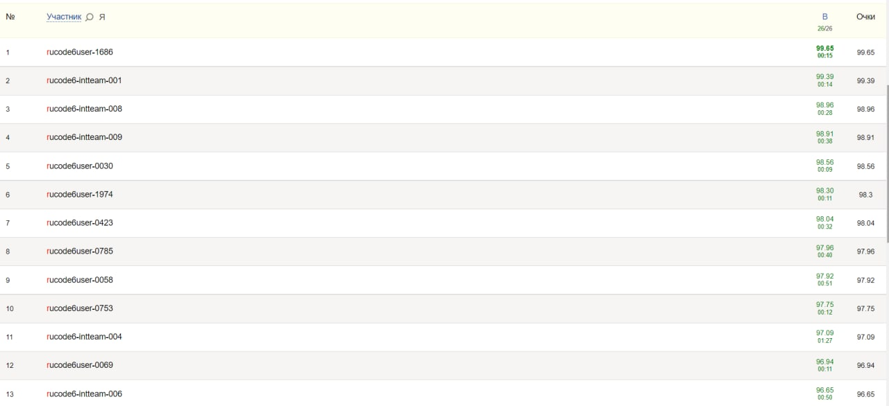

# rucode_6
2nd place solution to RuCode 6

Private leaderboard  (rucode6-intteam-001)|
:----------------------------------------:|
                  |

Link to extended dataset: https://www.kaggle.com/datasets/jutrera/stanford-car-dataset-by-classes-folder </br>
Link to pretrained ResNet50: https://drive.google.com/file/d/1OQuPh40GxujVyFdB3Ycwz_pbKYPmMwxb/view?usp=sharing

Guide:
1. Download dataset
2. Download pretrained ResNet50
3. Unzip pretrained ResNet50
4. Move dataset and pretrained ResNet50 to ```a/```
5. Mix extended dataset with given dataset (RuCode 6.0)
6. Install ```requirements.txt```
7. Launch notebook
